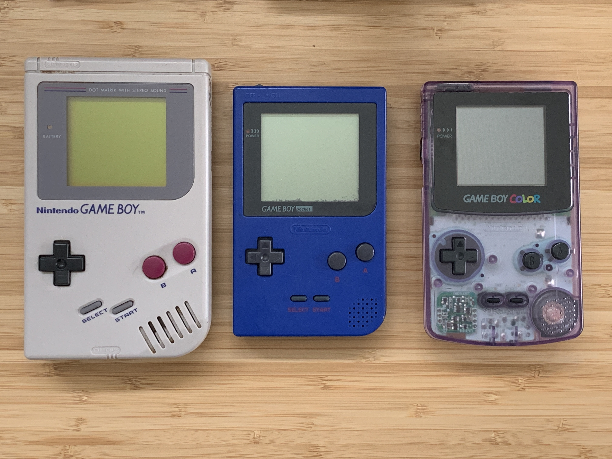

slidenumbers: true
footer: 
theme: Plain Jane
[.footer-style: center]

# Explore Hardware

### (old and new)

# w/CircuitPython


----

# Hi

Scott Shawcroft aka *tannewt*

Freelance software engineer

Project lead on CircuitPython for Adafruit


^ Hi, I'm Scott Shawcroft. I go by tannewt online. I'm the project lead on CircuitPython for Adafruit.

[.hide-footer]

---

# Plan

* CircuitPython Demo
* Vertical slice of CircuitPython
  * Software
  * Hardware
* GameBoy Demo

----

# CircuitPython Demo

^ Ok, let's jump right into a demo. Up here I have a Gameboy with a cart running CircuitPython.

---

# CircuitPython
## Code + Community

^ So that's the demo! Now let's begin our vertical slice of CircuitPython starting from the highest level down to the wire. CircuitPython consists of two main parts, the core code that runs on devices and the community built on top of it.

----

# **Code** + Community

* Python is the easiest way to iterate on software
* CircuitPython code and toolchain travels with the device for ultimate hackability
* `https://github.com/adafruit/circuitpython`
* Built on MicroPython

----

# Code **+ Community**

* Code of Conduct
* Active community on Discord and GitHub
* 190+ CircuitPython-compatible libraries
* 80+ Supported boards

----


[.hide-footer]

---



[.hide-footer]

---


[.hide-footer]

----


^ The most basic carts are simply ROM. They store all of the code and data needed for the game.

[.hide-footer]

---


# MCU as Cart

* DHole in late 2014 used an STM32F4 as a GameBoy cart.[^1]
* Respond with a byte on the data bus for every 1 MHz clock where the address is in cart range (`0x0000`-`0x7fff`)
* Chose to use the SAMD51 because it is 120 MHz and already had CircuitPython support

[^1]: `https://dhole.github.io/post/gameboy_cartridge_emu_1/`

[.hide-footer]

---

### `code.py`

[.code-highlight: all]

```python
from adafruit_gameboy import gb

# Register's are documented here:
# http://marc.rawer.de/Gameboy/Docs/GBCPUman.pdf

# Voice 1
#   - Bit 7 - Start
#   - Bit 6 - Counter/consecutive
#   - Bit 2-0 - Top 3 frequency bits
gb[0xff14] = 0b10000111 # 0x87
```

---

# The magic bit in `0xff14`


---

## User code - `code.py`

[.code-highlight: all]
[.code-highlight: 12]

```python
from adafruit_gameboy import gb

# Register's are documented here:
# http://marc.rawer.de/Gameboy/Docs/GBCPUman.pdf

offset = 0xff10 # Voice 1

# Voice 1
#   - Bit 7 - Start
#   - Bit 6 - Counter/consecutive
#   - Bit 2-0 - Top 3 frequency bits
gb[offset + 4] = 0b10000111 # 0x87
```

^ Expands the lowest level to simplify it

---

## Python library - `adafruit_gameboy.py`

[.code-highlight: 10-14]
[.code-highlight: 5-9]
[.code-highlight: 14]

```python
import gbio

class GameBoy:
    def __init__(self):
        self._byte_buf = bytearray(6)
        self._byte_buf[1] = 0x0e # Load next value into C
        self._byte_buf[3] = 0x3e # Load next value into A
        self._byte_buf[5] = 0xe2 # Load A into 0xff00 + C

    def __setitem__(self, index, value):
        if index > 0xff00:
            self._byte_buf[2] = index - 0xff00
            self._byte_buf[4] = value
            gbio.queue_commands(self._byte_buf)
```

^ Barest Python that has no dependencies

---

## Shared C API - module

[.code-highlight: 1,10-14]
[.code-highlight: 1,3-7]
[.code-highlight: 1,5]

```c
// shared-bindings/gbio/__init__.c

STATIC const mp_rom_map_elem_t gbio_module_globals_table[] = {
    { MP_ROM_QSTR(MP_QSTR___name__), MP_ROM_QSTR(MP_QSTR_gbio) },
    { MP_ROM_QSTR(MP_QSTR_queue_commands), MP_ROM_PTR(&gbio_queue_commands_obj) },
    { MP_ROM_QSTR(MP_QSTR_queue_vblank_commands), MP_ROM_PTR(&gbio_queue_vblank_commands_obj) },
};

STATIC MP_DEFINE_CONST_DICT(gbio_module_globals, gbio_module_globals_table);

const mp_obj_module_t gbio_module = {
    .base = { &mp_type_module },
    .globals = (mp_obj_dict_t*)&gbio_module_globals,
};
```
---

## Shared C API - function

[.code-highlight: 1,17]
[.code-highlight: all]
[.code-highlight: 1,3-6]
[.code-highlight: 1,9-13]
[.code-highlight: 1,14]

```c
// shared-bindings/gbio/__init__.c

//| .. method:: queue_commands(instructions)
//|
//|  These instructions are run immediately and this function will block until they finish.
//|
STATIC mp_obj_t gbio_queue_commands(mp_obj_t instructions){
    mp_buffer_info_t bufinfo;
    if (!mp_get_buffer(instructions, &bufinfo, MP_BUFFER_READ)) {
        mp_raise_TypeError(translate("buffer must be a bytes-like object"));
    } else if (bufinfo.typecode != 'B' && bufinfo.typecode != BYTEARRAY_TYPECODE) {
        mp_raise_ValueError(translate("instruction buffer must be a bytearray or array of type 'B'"));
    }
    common_hal_gbio_queue_commands(bufinfo.buf, bufinfo.len);
    return mp_const_none;
}
MP_DEFINE_CONST_FUN_OBJ_1(gbio_queue_commands_obj, gbio_queue_commands);
```

^ Hooks uniform C API to uniform Python API

---

## Lowest level C

[.code-highlight: 1,3]
[.code-highlight: all]

```c
// ports/atmel-samd/common-hal/gbio/__init__.c

void common_hal_gbio_queue_commands(const uint8_t* buf, uint32_t len) {
    // Wait for a previous sequence to finish.

    uint32_t total_len = 0;

    memcpy(command_cache + 2, buf, len);
    total_len += len;

    // Start DMA and wait for it.
    DmacDescriptor* descriptor_out = dma_descriptor(dma_out_channel);
    descriptor_out->BTCTRL.reg |= DMAC_BTCTRL_VALID;
    descriptor_out->BTCNT.reg = total_len;
    descriptor_out->SRCADDR.reg = ((uint32_t) command_cache) + total_len;
    descriptor_out->DSTADDR.reg = (uint32_t)&PORT->Group[0].OUT.reg + 2;

    dma_enable_channel(dma_out_channel);

    // Wait for DMA
}
```

^ Does time critical, chip-specific hardware interfacing

---

# Wire

---


---

# Timing Diagram


---

# Load our new value into register A


---

# Load address into register C


---

# Store A into 0xff00 + C


---

# Continue


---

# GameBoy Demo

---


`https://media.ccc.de/v/33c3-8029-the_ultimate_game_boy_talk`

[.text: #222222, alignment(center), line-height(1), text-scale(0.8), FuraCode Nerd Font]

----

# Getting started

* Reach out on our Discord chat: https://adafru.it/discord
* Help us make CircuitPython the easiest way to learn to code and the best example of Python on hardware.

^ So, I hope this has gotten everyone excited about CircuitPython and how it can supercharge your hardware.

---

# Contact

@tannewt

scott@adafruit.com

circuitpython.org

github.com/tannewt/presentations

---

# Thank you!
