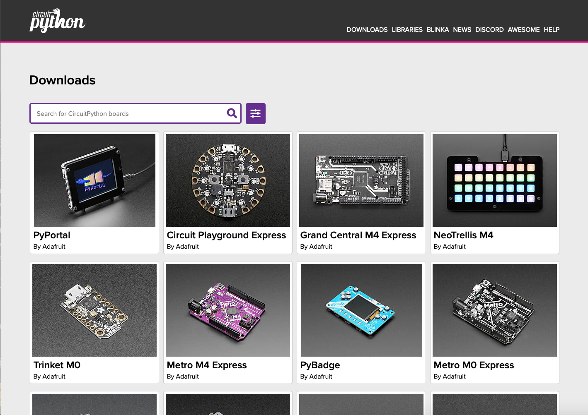
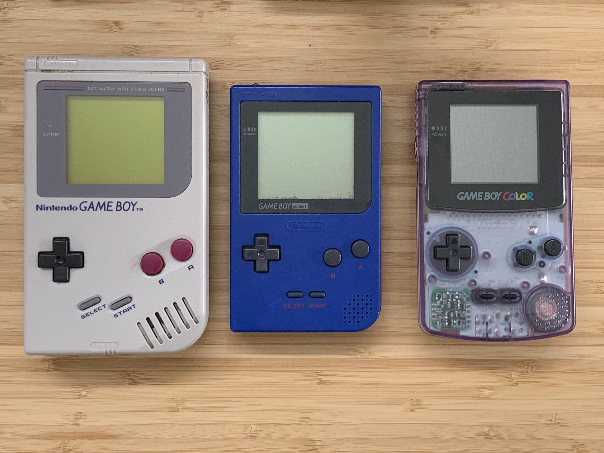
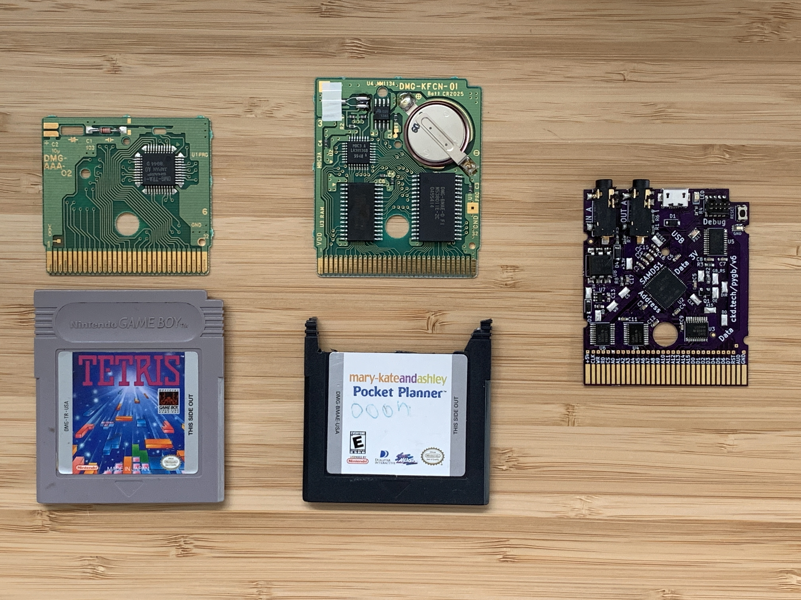
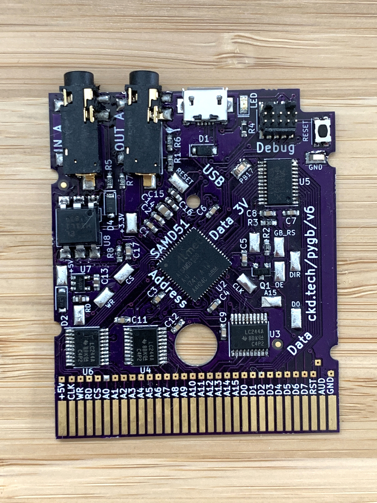
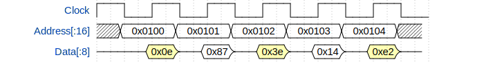
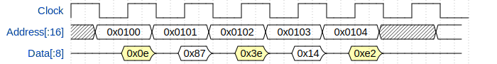
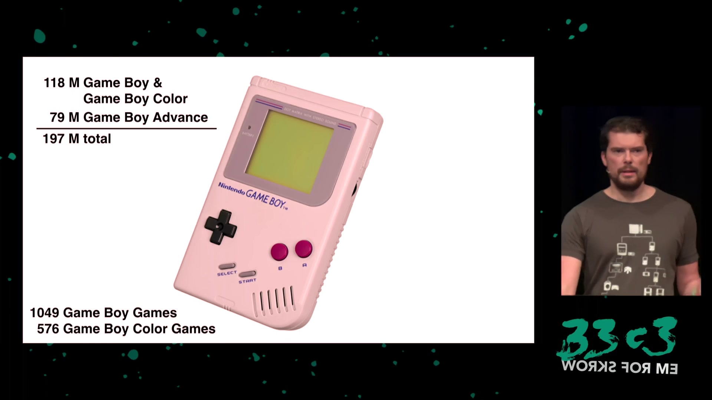

slidenumbers: true
footer: 
theme: Plain Jane
[.footer-style: center]

# Supercharge Your Hardware

### (old and new)

# w/CircuitPython


----

# Hi

Scott Shawcroft aka *tannewt*

Freelance software engineer

Project lead on CircuitPython for Adafruit


^ Hi, I'm Scott Shawcroft. I go by tannewt online. I'm the project lead on CircuitPython for Adafruit.

[.hide-footer]

---

# Plan

* CircuitPlayground Demo
* Vertical slice of CircuitPython
  * Software
  * Hardware
* GameBoy Demo

----

# CircuitPlayground Demo

^ Ok, let's jump right into a demo. Up here I have a Gameboy with a cart running CircuitPython.

---

# CircuitPython
## Code + Community

^ So that's the demo! Now let's begin our vertical slice of CircuitPython starting from the highest level down to the wire. CircuitPython consists of two main parts, the core code that runs on devices and the community built on top of it.

----

# **Code** + Community

* Python is the easiest way to iterate on software
* CircuitPython code and toolchain travels with the device for ultimate hackability
* `https://github.com/adafruit/circuitpython`
* Built on MicroPython

----

# Code **+ Community**

* Code of Conduct
* Active community on Discord and GitHub
* 190+ CircuitPython-compatible libraries
* 83+ Supported boards

----




[.hide-footer]

---



[.hide-footer]

---


[.hide-footer]

----



^ The most basic carts are simply ROM. They store all of the code and data needed for the game.

[.hide-footer]

---



# MCU as Cart

* DHole in late 2014 used an STM32F4 as a GameBoy cart.[^1]
* Respond with a byte on the data bus for every 1 MHz clock where the address is in cart range (`0x0000`-`0x7fff`)
* Chose to use the SAMD51 because it is 120 MHz and already had CircuitPython support

[^1]: `https://dhole.github.io/post/gameboy_cartridge_emu_1/`

[.hide-footer]

---

# Layers

* Python Libraries - Expands the lowest level to simplify it
* Lowest Python - Barest Python that has no dependencies
* C <-> Python - hooks uniform C API to uniform Python API
* Lowest C - does time critical, chip-specific hardware interfacing
* The wire to the GameBoy CPU

---

# The magic bit in `0xff14`


---

### `code.py`

[.code-highlight: all]
[.code-highlight: 11]

```python
from adafruit_gameboy import gb

# Register's are documented here: http://marc.rawer.de/Gameboy/Docs/GBCPUman.pdf

offset = 0xff10 # Voice 1

# Voice 1
#   - Bit 7 - Start
#   - Bit 6 - Counter/consecutive
#   - Bit 2-0 - Top 3 frequency bits
gb[offset + 4] = 0b10000111 # 0x87
```

---

# Some layers later...

---

### `ports/atmel-samd/common-hal/gbio/__init__.c`

```c
void common_hal_gbio_queue_commands(const uint8_t* buf, uint32_t len) {
    // Wait for a previous sequence to finish.

    uint32_t total_len = 0;

    memcpy(command_cache + 2, buf, len);
    total_len += len;

    // Start DMA and wait for it.
    DmacDescriptor* descriptor_out = dma_descriptor(dma_out_channel);
    descriptor_out->BTCTRL.reg |= DMAC_BTCTRL_VALID;
    descriptor_out->BTCNT.reg = total_len;
    descriptor_out->SRCADDR.reg = ((uint32_t) command_cache) + total_len;
    descriptor_out->DSTADDR.reg = (uint32_t)&PORT->Group[0].OUT.reg + 2;

    dma_enable_channel(dma_out_channel);

    // Wait for DMA
}
```

---

# DMA Trigger

Use the SAMD51 CCLUT to do:

## **A15 | Read | Clock**

Then drive the DMA and the level shifter output enable based on it.

^ The DMA is clocked by a signal generated by a LUT within the SAMD51 that detects when the address is within range, a read is happening and the clock is low.

^ It gets a bit trickier in that we have 120 cycles at most in the worst case. We need to be careful to DMA out of memory that isn't under heavy use. For example, placing the commands in RAM alongside a volatile flag that is being busy waited on can starve the DMA since the CPU has priority over DMA. The solution is to place the commands in a separate RAM bank than the one used by the CPU.

---

# Load our new value into register A


---

# Load address into register C


---

# Store A into 0xff00 + C



---

# Continue



----

# GameBoy Demo

^ Ok, let's jump right into a demo. Up here I have a Gameboy with a cart running CircuitPython.

---


`https://media.ccc.de/v/33c3-8029-the_ultimate_game_boy_talk`

[.text: #222222, alignment(center), line-height(1), text-scale(0.8), FuraCode Nerd Font]

----
# Takeaways

* CircuitPython is the easiest way to program hardware.
* C can be used to do anything from Python.
* Existing hardware can benefit from CircuitPython.

----

# Get started!

* We can help you get CircuitPython on **your** hardware.
  * Supported: SAMD21, SAMD51, nRF52840, STM32F4
  * Coming soon: iMX RT
* Reach out on our Discord chat: https://adafru.it/discord
* Code: https://github.com/adafruit/circuitpython

^ So, I hope this has gotten everyone excited about CircuitPython and how it can supercharge your hardware.

---

# Contact

@tannewt

scott@adafruit.com

circuitpython.org

---

# Thank you!
