# Python's Next Decade and **Us**

^ Let’s brainstorm where Python will grow in the 2020s! Who will be using Python in 2030 and why? How will people use Python? Where will Python fit in the global computing community? What can we do to make our ideal Python over the next decade? What TLC will help Python the most?

---

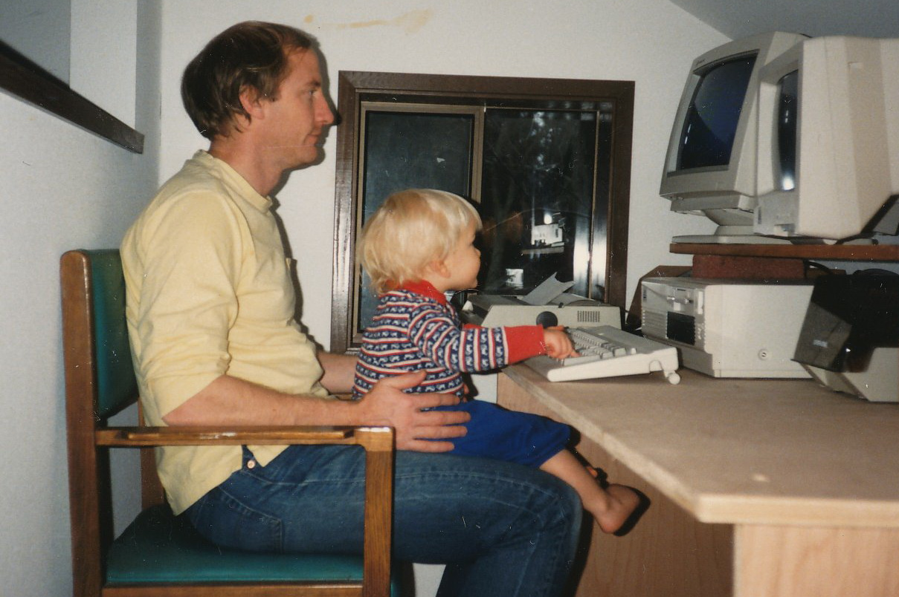

^ Introduction and why and how I got into Python: 4 minutes

---

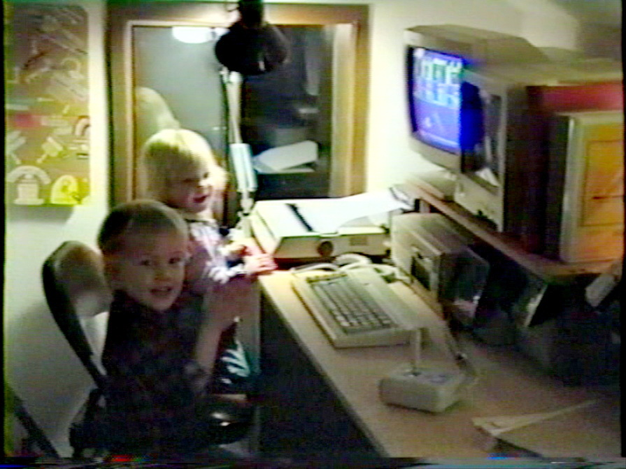

---

[.background-color: #444444]

---

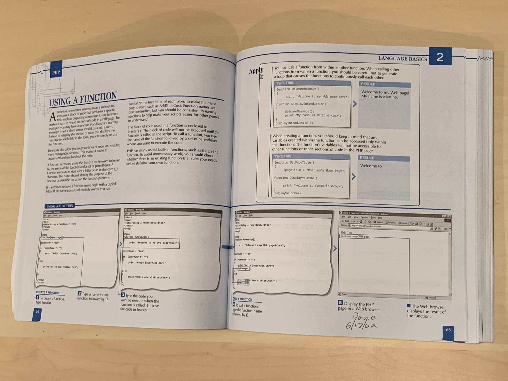

---

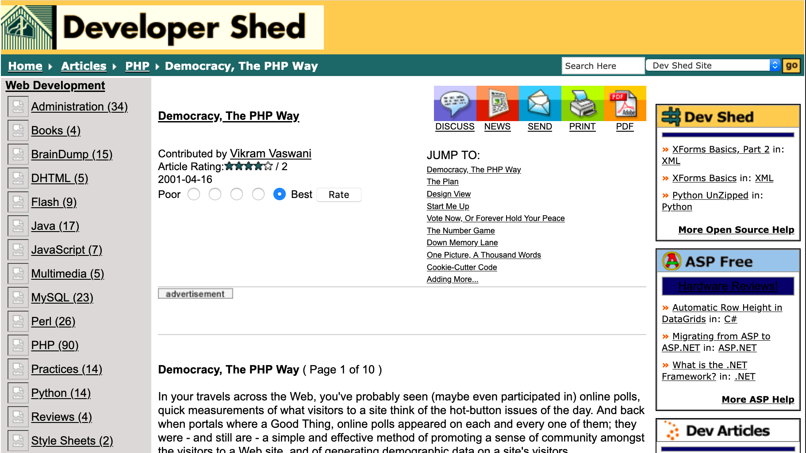

---

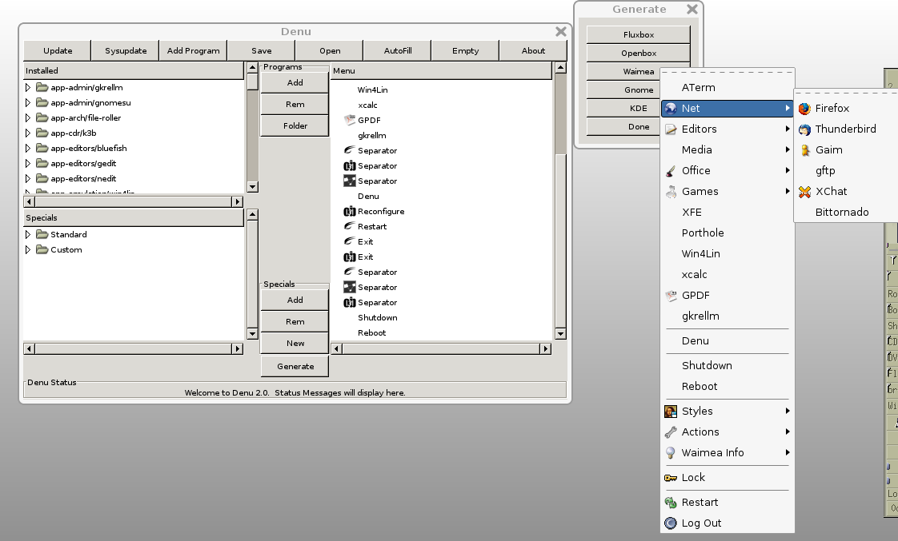

---

## What about you?

---

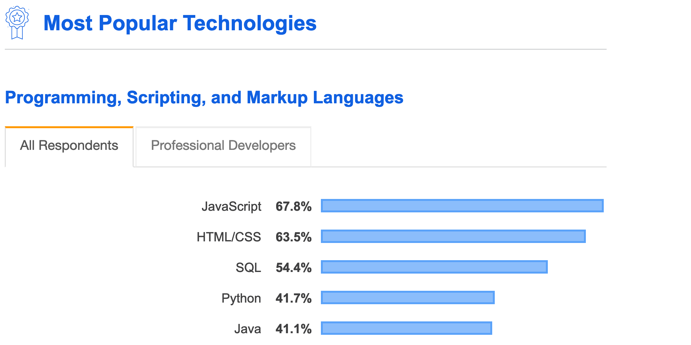

^ Ok, lets talk stats. Python is #4 in use according to StackOverflow 2019 and #2 in most loved! Does that matter? https://insights.stackoverflow.com/survey/2019#technology

---

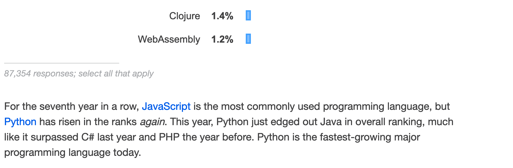

^ https://insights.stackoverflow.com/survey/2019#technology

---

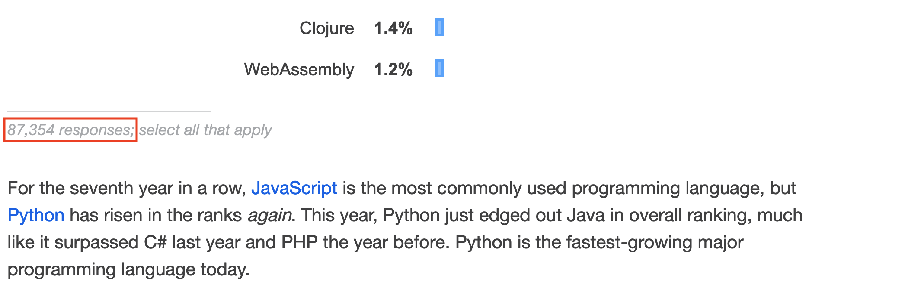

^ https://insights.stackoverflow.com/survey/2019#technology

---

## 87,354 responses

^ NOPE! We shouldn’t be in this to be number 1. We’re all here because Python has empowered us to do something with computers. Computers are one of the most important tools human kind has every created. Being able to use them is the most important thing. What language it is doesn’t matter.

---

## 7,794,799,000 people

^ https://population.un.org/wpp/DataQuery/ for 2020

---

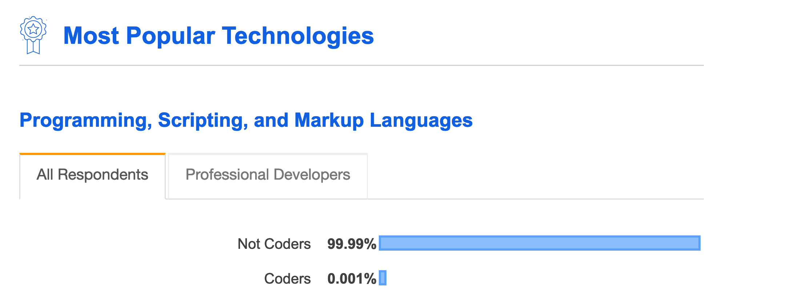

^ Here is the fixed chart.

---

## 23,900,000 developers

^ OK, I can hear the rebuttals coming that 87k is too low. Well an estimate of the number of developers worldwide pegged the number at 23.9 million. So I've adjusted the chart for it.

---

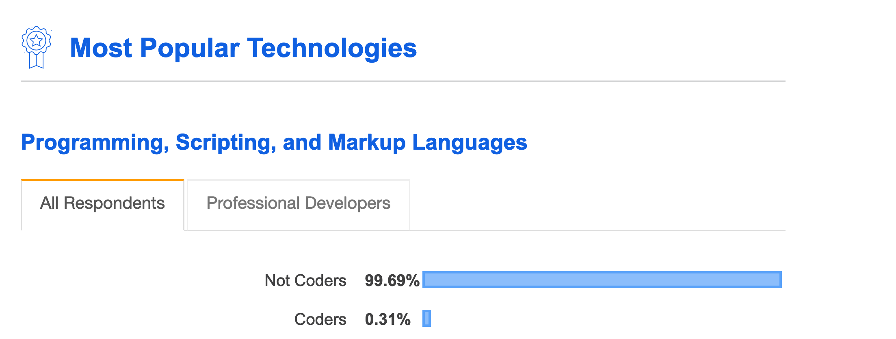

^ Out 7.6 billion people on Earth only an estimated 23.9 million (with an m) are developers. That is 0.3% of the world’s population. https://evansdata.com/reports/viewRelease.php?reportID=9

---

---

## 261,000,000 💻
## vs
## 1,524,838,000📱

^ https://www.gartner.com/en/newsroom/press-releases/2020-01-13-gartner-says-worldwide-pc-shipments-grew-2-point-3-percent-in-4q19-and-point-6-percent-for-the-year
^ https://www.gartner.com/en/newsroom/press-releases/2020-01-28-gartner-says-worldwide-smartphone-sales-will-grow-3--

---

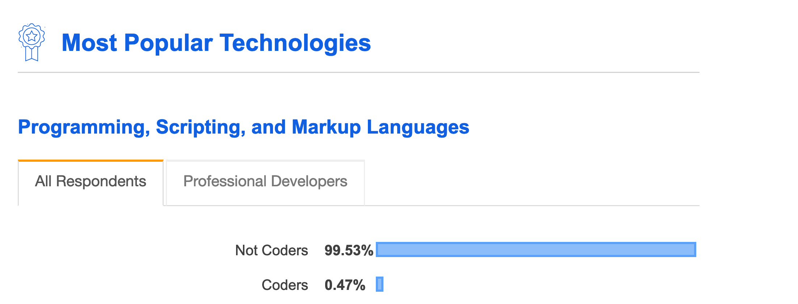

^ Oh, and some of those folks don't even have a computer. Let's just count folks who do. At the end of 2018 there were 5.1 billion people with mobile services. https://www.gsmaintelligence.com/research/?file=b9a6e6202ee1d5f787cfebb95d3639c5&download

^ This final adjusted version shows that 0.47% of all folks with computer access, 23 million ish, are developers.

^ Let’s not be afraid of other languages. They are doing many interesting things that we can learn from. Plus we’re all on the same side. 7 minutes

---

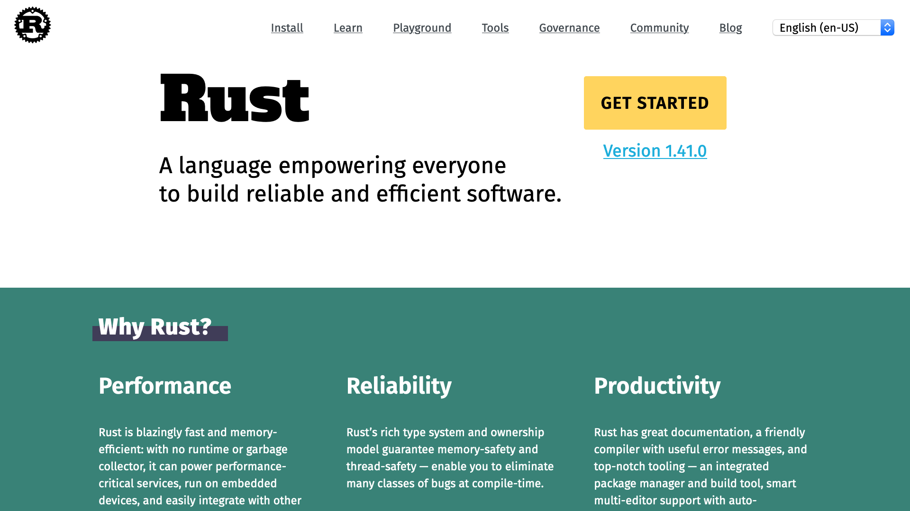

^ Rust’s memory model.

---

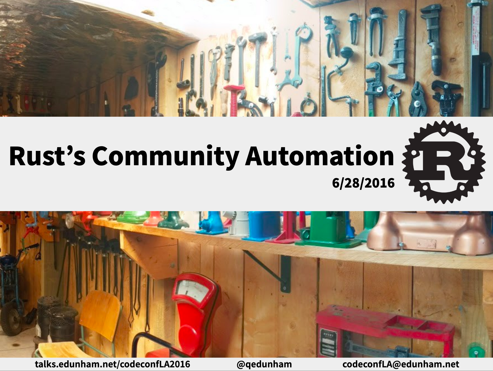

https://youtu.be/407nwX6__70

^ Rust community.

---

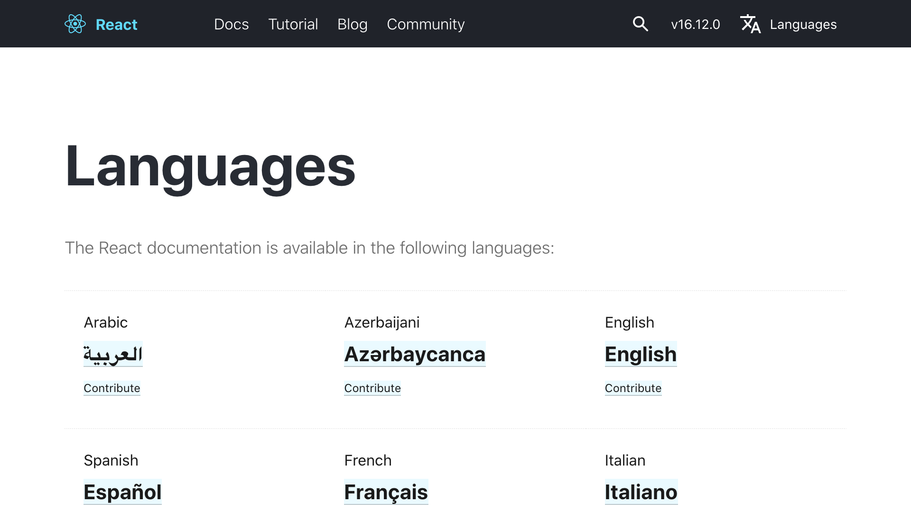

^ React’s docs being translated. https://reactjs.org/languages/

---

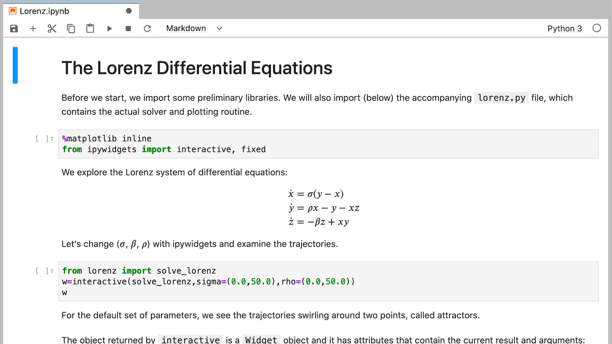

^ Collab and Jupyter are doing very cool things. Bring prose-first, interactive computing to many programming languages including Python.

---

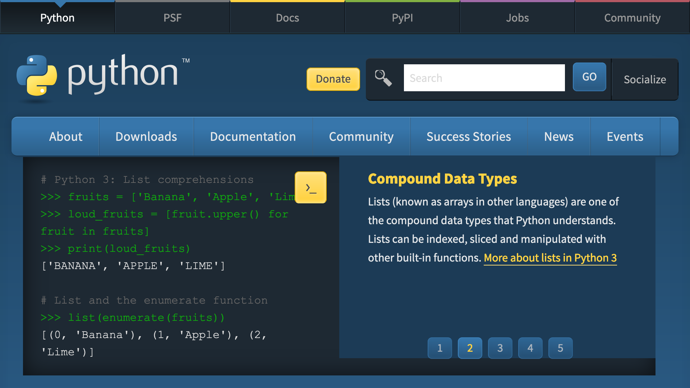

^ What should we do?

---

## What will Python **be** in 10 years?

^ Today Python can, automate tasks, serve webpages, process tons of data and make an led blink. How many of those 5.1 billion phone users want to do these things? What will we be able to do with PYthon a decade from now?

---

# TLC

^  TLC 4 minutes

---

## Teach

^ Help empower others by teaching them Python. There is no better way to discover the bumps and bruises taken when learning something new than to teach it to someone.

---

## Listen

^ Listen to others about what they need from the computers they use everyday. Think of someone you know who doesn’t program. What tasks could they automate with computers? What would it take to use Python? Help other’s outside of your field who also use Python. Data scientists talk to web devs and vice versa.

---

## Contribute

^ There is no such thing as too easy. Each little bump in the road can throw someone off.
            Smooth over every bump that folks hit when learning Python even if it means writing docs or another programming language.
            Computer languages are almost all English, do whatever it takes to bring computing to another’s spoken language.

---

# Python's Next Decade and **Us**

---

# Computing's ~~*Python's*~~ Next Decade and ~~*Us*~~ Everyone

