# Outside In
## Better Interface Design

### Scott (@tannewt)

---

# An *interface* is a boundary between two things

---

# A *well designed* interface defines the *what* without revealing the *how*.

^ Abstraction lets one ignore the "how" of *what* the interface does. Abstract interfaces enable multiple uses of the same interface which increases compatibility between things. Open interfaces allow others to work against the same abstractions and collaborate on different things.

---

# Abstraction of the *how* into *what* allows for reuse.

---

---

## https://github.com/adafruit/awesome-feather/

---

In open hardware there are three common category of interfaces:

* Mechanical
* Electrical
* Software

---

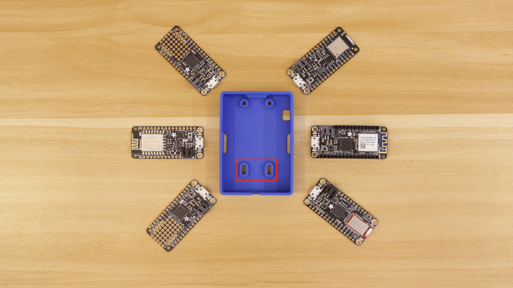

^ *Outside In* mechanical design may be designing for an existing case. In this case, the print was designed inside out. The second hole is a slot to accomodate different feather lengths. This is a sign of flexibility in the interface that if unbounded could lead to incompatibility and break the abstraction provide by the Feather interface.

---

# Mechanical

* Board size
* Mounting holes
* Component size
* Electrical connection location

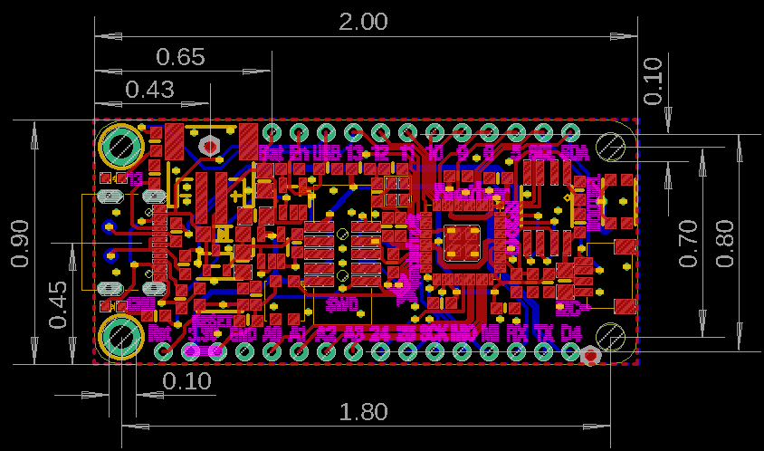

---
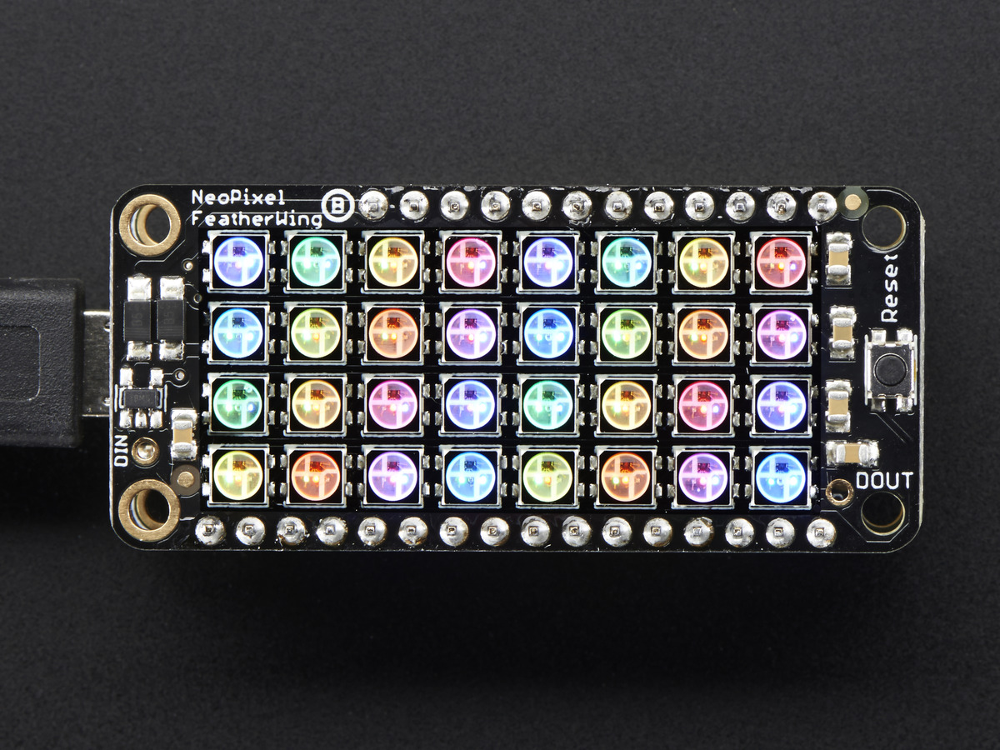

---

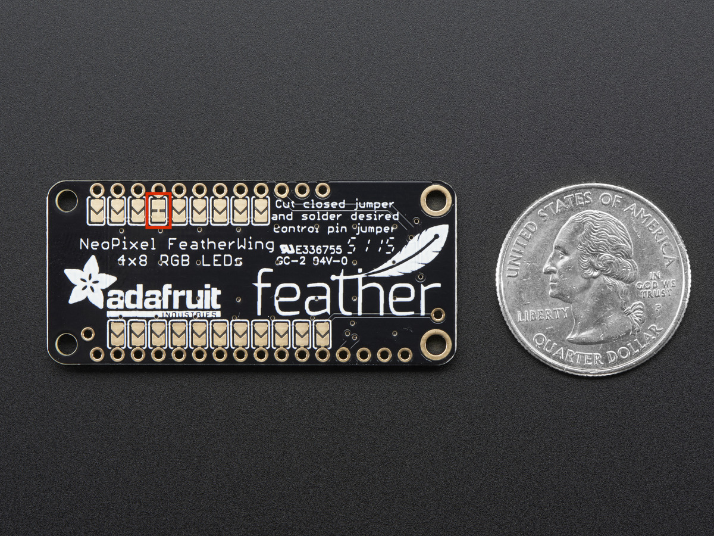

---

# Electrical

* Depends on *mechanical* interfaces through contact position
* Designated function(s)/protocol(s)
* Voltage levels
* Input/output

---

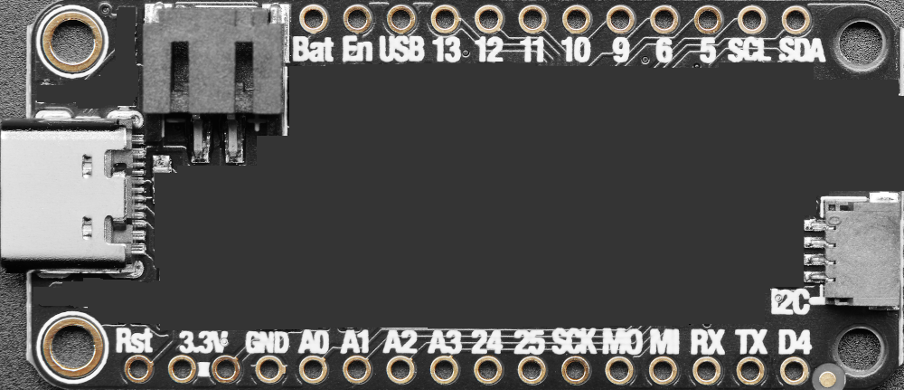

---

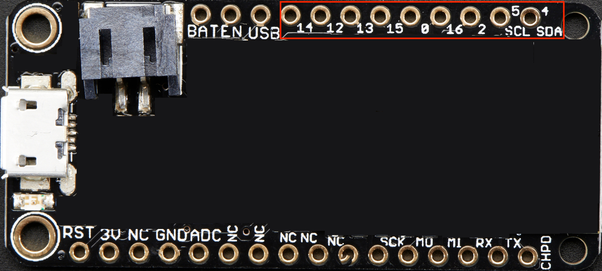

---

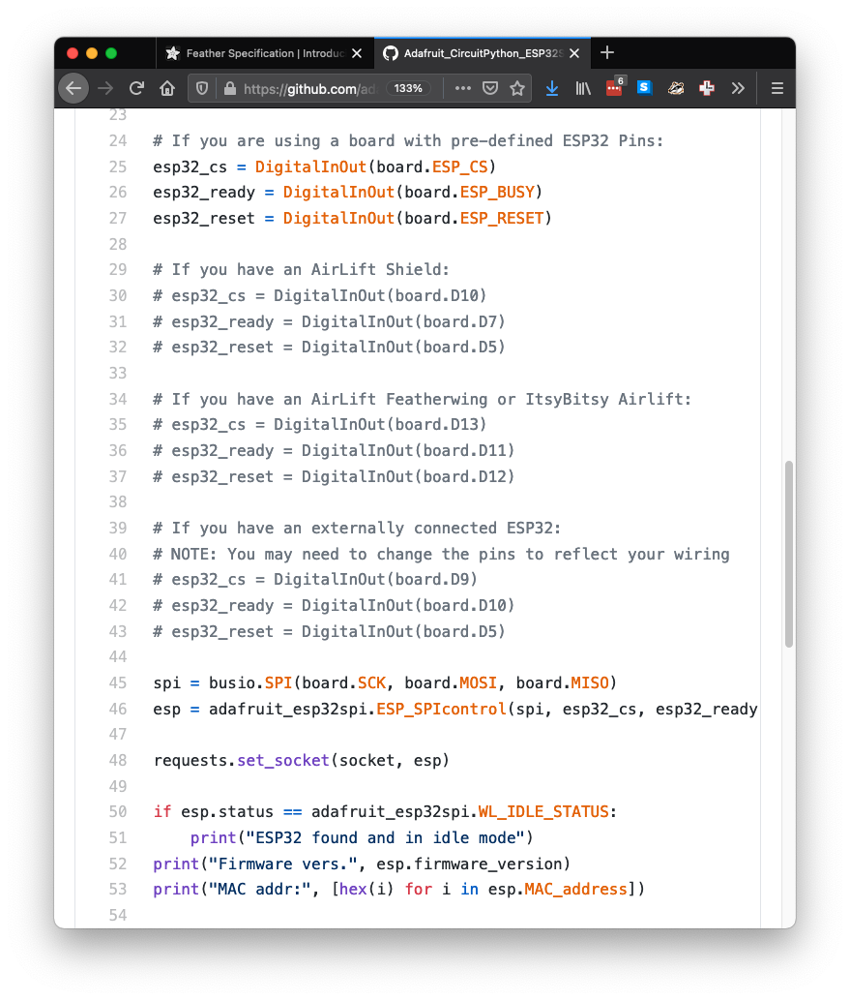

^ Remember that pin naming impacts software! Software impacts libraries, examples and tutorial content.

---

# Software

* Names!
* Interaction
* Default software
* Bootloader

---

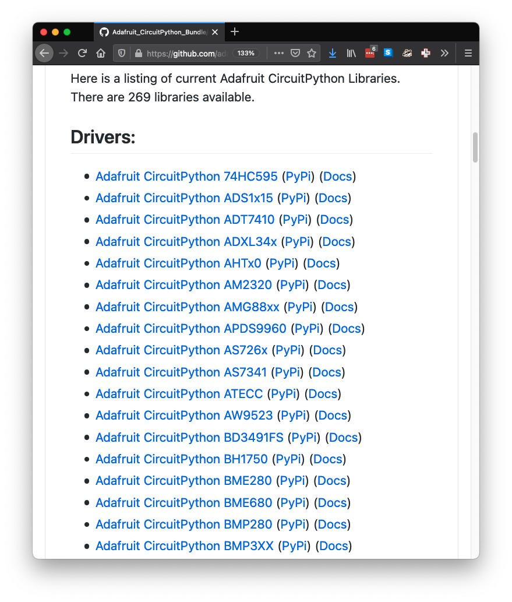

---

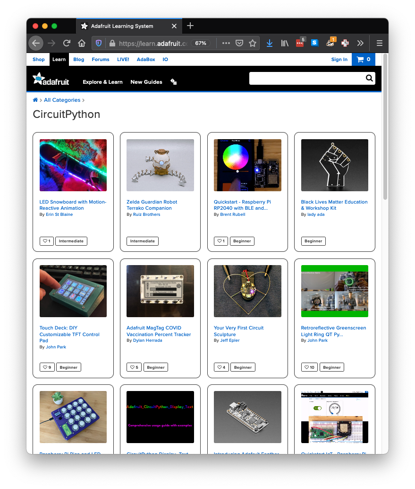

---

# Think Outside In

---

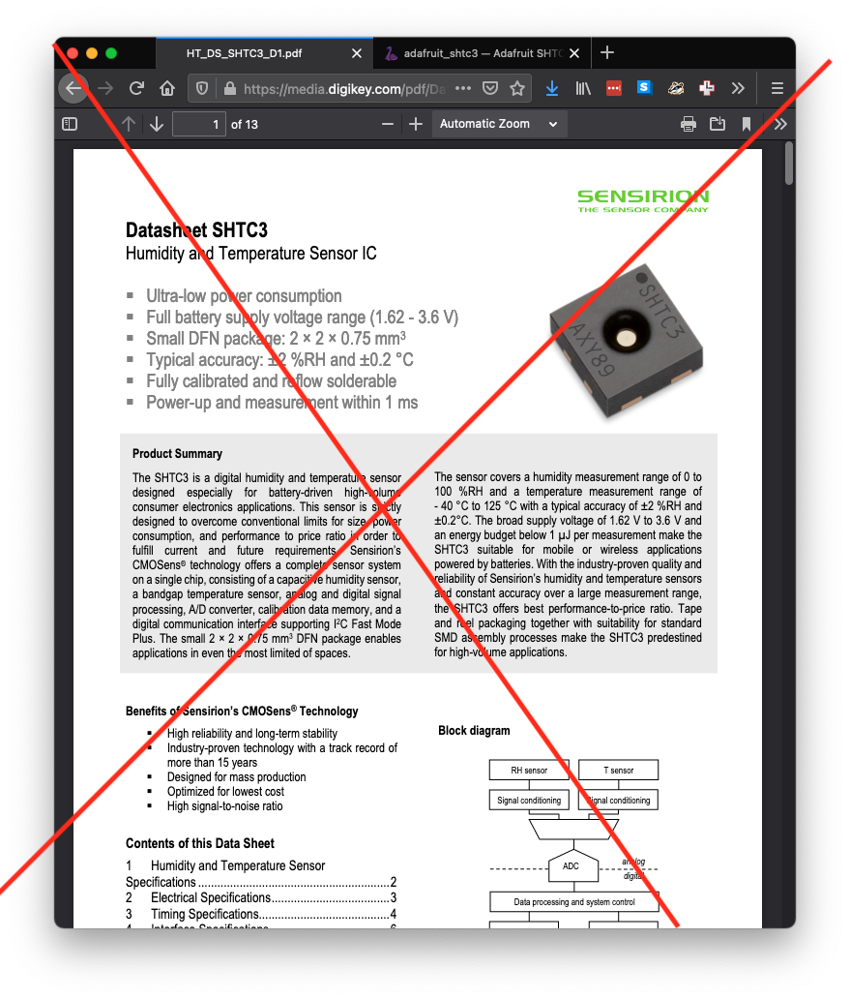

^ The feather pin numbering was different because the inside numbers were different than those of the other feathers. In particular, the Espressif Arduino core doesn't do number mapping to allow consistent numbers across boards. It assumes inside out numbering. Vendors tend to do this a bunch (Pico does as well.) It's better to abstract the numbering from the get-go so that new boards in the same form factor don't need to break the inside out numbering.

---

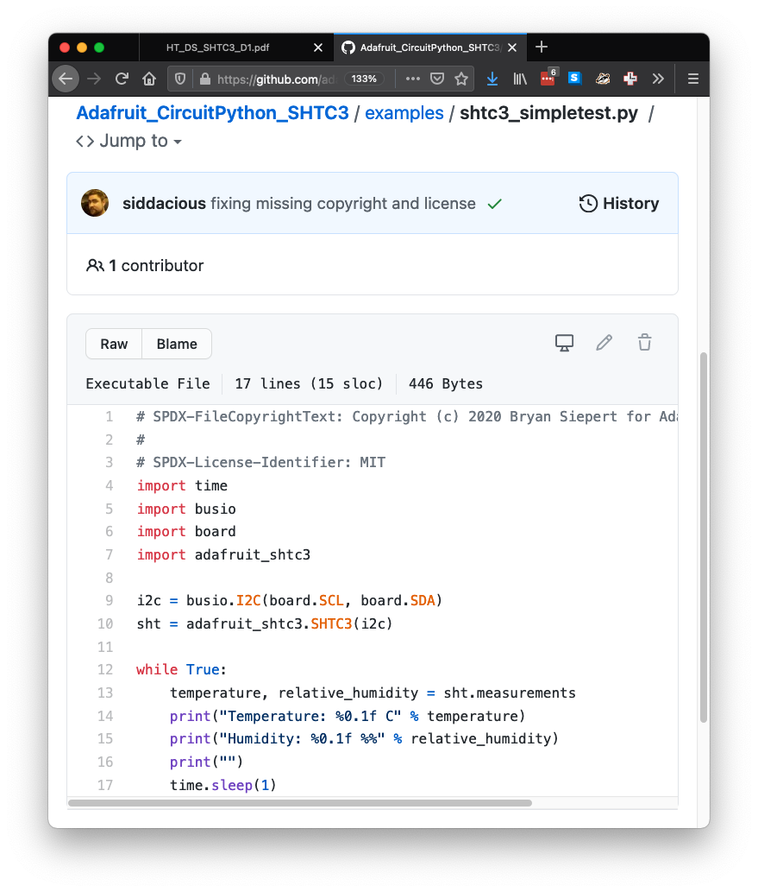

---

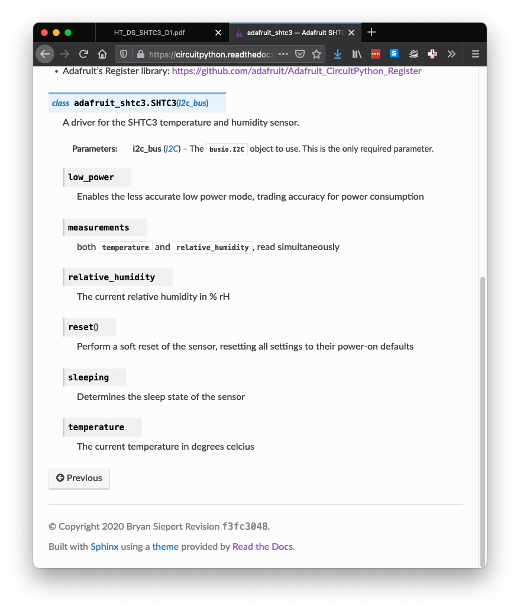

---

# Be Explicit

^ When designing a new product or interface be explicit with requirements. Even when allowing for flexiblity, set explicit bounds. Any omited detail may lead to incompatibilities in the future.

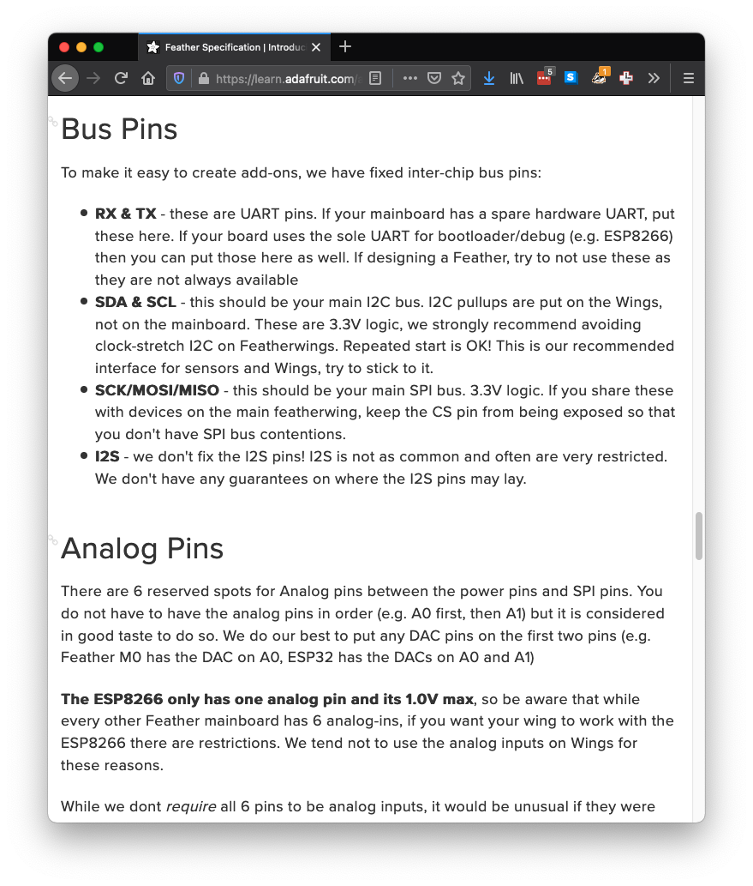

---

# Be Strict

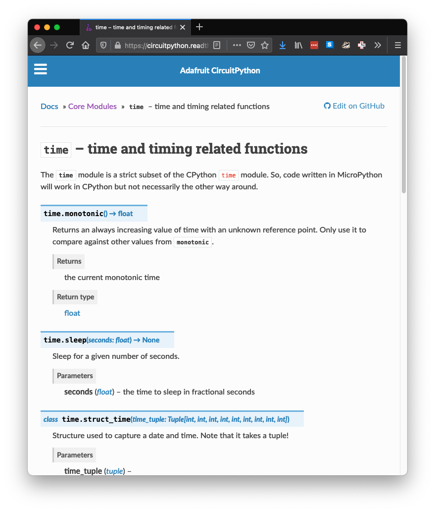

^ In CircuitPython we reimplement some desktop "CPython" APIs by being strict subsets. This allows for code written in CP to be reused in CPython. Do this for hardware too. Keep the same shape and silkscreen names as another board even if it isn't part of a formal interface. This can come up when a v2 version of a board is made.

---

# Remember

Interfaces are:
* Mechanical
* Electrical
* Software

To design one well:
* Think outside in
* Be explicit when designing an interface
* Be strict when implementing an existing interface

^ Designing a perfect interface is impossible but a good interface isn't. By thinking outside in, being explicit on specs and strict in implementation you'll have the best shot at producing an interface that enables abstraction and reuse.
