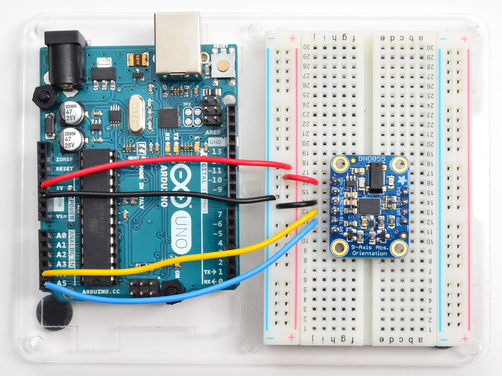

# *Circuit*Python

---

# Hi

Scott Shawcroft aka *tannewt*

freelance software engineer

Project lead on CircuitPython for Adafruit

.jpg)

^ Hi, I'm Scott Shawcroft. I go by tannewt online. I'm the project lead on CircuitPython for Adafruit.

---

^ *Adafruit* is a company focused on teaching people to use open source electronics. From the beginning, Limor (aka ladyada), the founder of Adafruit focused on tutorials and open learning. For example, I learned all about designing test jigs for manufacturing through her Desk of Ladyada videos where she streams her work.

---

# Demo

^ 48+ Mhz
^ 32k+ RAM
^ 256k+ flash

^ These are much smaller computers than your phone or laptop where RAM is measure in gigabytes.

^ The flash effectively stores the binary. A CPython installer is 25 megabytes, roughly 100 times the size.

---

^ Created by Damien George in 2013, MicroPython reimplemented Python 3.4 on a custom board. MicroPython did the initial work of getting Python on a microcontroller.

---

^ In August of 2016, Adafruit asked me to port MicroPython to the SAMD21, the chip on the Arduino Zero and a number of new Adafruit boards.

^ While much of the core VM bits of MicroPython can be easily moved between platforms, the input and output hardware varies by microcontroller. So, I forked to add serial and USB support for the SAMD21.

---

^ Once we could access the REPL on the SAMD21 we began work on supporting other input and output methods that allow the code to talk to external sensors. The goal is to make it easy for anyone to make something with open source hardware and software. The more breadth in support, the wider the project space people could hack on.

^ As I dug into the hardware APIs of MicroPython it became clear to me that it wasn't a great foundation for us to build our driver library on. The MicroPython machine API varied between chip families and Damien wanted the flexibility and speed of custom, optimized APIs for each family.

---

*Lots* of *small libraries* all zipped up together.

^ Once we had a standard hardware API, we could build our libraries on top of it. Each module needed to be small so that it could fit into 32k ram and leave room for user code.

^ Since our devices are not typically connected to the internet we opted for a system of zipping all of the libraries up. People understand how to work with USB drives and zip files. Most boards have spare flash so storing unused code isn't a huge issue. Only on import does it cost RAM.

---

Libraries also *work in CPython* on single board computers

^ We also chose to prefer that CircuitPython versions of standard CPython modules would be strict subsets. MicroPython had added addional API as it needed, for file system management for example. Our original reason for this was to ensure that beginners who learn Python first on CircuitPython can easily grow into CPython later.

^ A valuable side effect of this decision was that our libraries would run within CPython without modifying CPython libraries. We had to support our APIs but the standard ones weren't too bad. The trickiest bit was Linux-isms, not CPython-isms.

---

# FORK

^ With these decisions it became clear that the goals of the two projects were different. MicroPython was geared towards speed and an audience with an existing hardware background. So much so, that they broke compatibility with CPython in a few cases.

^ With CircuitPython we wanted to be much stricter about being a subset of CPython so that beginners could learn Python from CircuitPython and apply it to CPython. We are ok sacrificing speed for more consistency with CPython. So, we chose to be independent so that we could define our own vision and move fast.

---

Focus on the *beginner* and optimize for their *very first* experience coding.

^ Our goal is to teach everyone how to build whatever electronics project interests them. Once we have the API foundation and libraries, the challenge is lowering the barrier to entry.

---

^ I already showed the auto-reload in the demo. It is great because it lowers the iteration time and you don't need to worry about how to run code.

^ Two other ways we've focused on the beginner in our latest 4.0.0 release is by showing serial output on a connected display and by translating our messages into the user's language. Hopefully it makes errors a little more friendly.

---

---

# Thank you!

---

# Questions?

@tannewt

scott@adafruit.com

circuitpython.org
