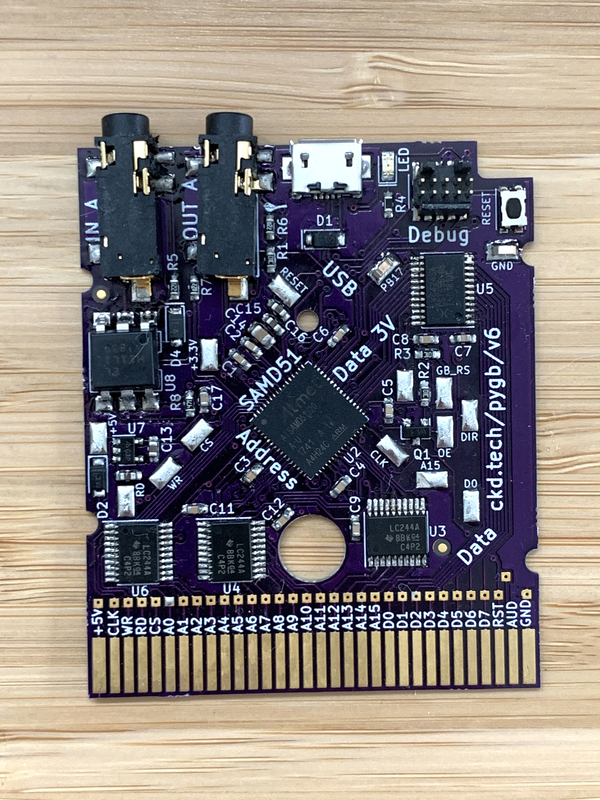

slidenumbers: true
footer: 
theme: Plain Jane
[.footer-style: center]

# Supercharge Your Hardware

### (old and new)

# w/CircuitPython


----

# Hi

Scott Shawcroft aka *tannewt*

Freelance software engineer

Project lead on CircuitPython for Adafruit


^ Hi, I'm Scott Shawcroft. I go by tannewt online. I'm the project lead on CircuitPython for Adafruit.

[.hide-footer]

---

# Plan

* Live demo!
* What do I mean by supercharging?
* Vertical slice of CircuitPython
  * Hardware
  * Software

----

# Demo

^ Ok, let's jump right into a demo. Up here I have a Gameboy with a cart running CircuitPython.

---


`https://media.ccc.de/v/33c3-8029-the_ultimate_game_boy_talk`

[.text: #222222, alignment(center), line-height(1), text-scale(0.8), FuraCode Nerd Font]

----

# **Code** + Community

* Python is the easiest way to iterate on software
* CircuitPython code and toolchain travels with the device for ultimate hackability
* Supported chipsets: SAMD21, SAMD51 and nRF52840
* Built on MicroPython

----

# Code **+ Community**

* Code of Conduct
* Active community on Discord and GitHub
* 150+ CircuitPython-compatible libraries
* 60+ Supported boards

----


[.hide-footer]

---


[.hide-footer]

----


^ The GameBoy holds a special place in my heart because it was the first video game system I ever owned. Three decades of homebrew have led to an amazing understanding of the hardware (particularly for emulators) and some custom tools to create ROMs. Let's talk hardware.

[.hide-footer]

---

# Hardware

----


[.hide-footer]

----


^ The most basic carts are simply ROM. They store all of the code and data needed for the game.

[.hide-footer]

---



# MCU as Cart

* DHole in late 2014 used an STM32F4 as a GameBoy cart.[^1]
* Respond with a byte on the data bus for every 1 MHz clock where the address is in cart range (`0x0000`-`0x7fff`)
* Chose to use the SAMD51 because it is 120 MHz and already had CircuitPython support

[^1]: `https://dhole.github.io/post/gameboy_cartridge_emu_1/`

[.hide-footer]

---

# SAMD51

* Cart has access to reset line
* Use DMA to queue up sequences of data that (mostly) write GameBoy Memory.
* DMA is clocked by the AND of A15, clock, and read. Use a CCLUT so the processor can ignore it.
* Game logic in CircuitPython on the '51 rather than the GameBoy CPU

---

# Software

### `https://github.com/adafruit/circuitpython`

---

# Adding a board

  * Duplicate a board folder in `ports/<mcu>/boards`
  * Update config files including pin mapping
  * Add to `.travis.yml`
  * Add to https://circuitpython.org[^3]

[^3]: https://github.com/adafruit/circuitpython-org

---


# Bootloader

* Reads the Nintendo logo for display
* Reads the Nintendo logo to validate the cart
* Reads the cart metadata to validate checksum
* Plays the chime
* If all goes well, then continues to 0x0100[^2] on the cart 🎉

[^2]: http://gbdev.gg8.se/wiki/articles/Gameboy_Bootstrap_ROM

[.hide-footer]
---

# Layers

* Lowest C - does time critical, hardware interfacing
* C <-> Python - hooks C to the Python VM
* Lowest Python - Barest Python that has no dependencies
* Python Libraries - Expands the lowest level to simplify it

---

```c
void common_hal_gbio_queue_commands(const uint8_t* buf, uint32_t len) {
    // Wait for a previous sequence to finish.

    // Disable interrupts while we are transmitting because we an interrupt can misinterpret a
    // our data as invalid instructions and crash. The better way to handle this would be to have
    // the address interrupt catch an interrupt, set the data bus to noop and recover the
    // interrupted code.

    memcpy(command_cache + 2, buf, len);

    command_cache[len] = 0x21; // Load into hl
    command_cache[len + 1] = 0x00; // Load into hl
    command_cache[len + 2] = 0x10; // Load into hl
    command_cache[len + 3] = 0xfb; // Enable interrupts
    command_cache[len + 4] = 0xe9; // jump to where hl points.
    len += 5;

    // Start DMA and wait for it.
}
```

---

```c
//| .. method:: queue_commands(instructions)
//|
//|  These instructions are run immediately and this function will block until they finish.
//|
STATIC mp_obj_t gbio_queue_commands(mp_obj_t instructions){
    mp_buffer_info_t bufinfo;
    if (!mp_get_buffer(instructions, &bufinfo, MP_BUFFER_READ)) {
        mp_raise_TypeError(translate("buffer must be a bytes-like object"));
    } else if (bufinfo.typecode != 'B' && bufinfo.typecode != BYTEARRAY_TYPECODE) {
        mp_raise_ValueError(translate("instruction buffer must be a bytearray or array of type 'B'"));
    }
    common_hal_gbio_queue_commands(bufinfo.buf, bufinfo.len);
    return mp_const_none;
}
MP_DEFINE_CONST_FUN_OBJ_1(gbio_queue_commands_obj, gbio_queue_commands);
```

---

```c
STATIC const mp_rom_map_elem_t gbio_module_globals_table[] = {
    { MP_ROM_QSTR(MP_QSTR___name__), MP_ROM_QSTR(MP_QSTR_gbio) },
    { MP_ROM_QSTR(MP_QSTR_queue_commands), MP_ROM_PTR(&gbio_queue_commands_obj) },
    { MP_ROM_QSTR(MP_QSTR_queue_vblank_commands), MP_ROM_PTR(&gbio_queue_vblank_commands_obj) },

    { MP_ROM_QSTR(MP_QSTR_set_lcdc), MP_ROM_PTR(&gbio_set_lcdc_obj) },
    { MP_ROM_QSTR(MP_QSTR_get_lcdc), MP_ROM_PTR(&gbio_get_lcdc_obj) },

    { MP_ROM_QSTR(MP_QSTR_get_pressed), MP_ROM_PTR(&gbio_get_pressed_obj) },
    { MP_ROM_QSTR(MP_QSTR_wait_for_vblank), MP_ROM_PTR(&gbio_wait_for_vblank_obj) },
    { MP_ROM_QSTR(MP_QSTR_is_color), MP_ROM_PTR(&gbio_is_color_obj) },
};

STATIC MP_DEFINE_CONST_DICT(gbio_module_globals, gbio_module_globals_table);

const mp_obj_module_t gbio_module = {
    .base = { &mp_type_module },
    .globals = (mp_obj_dict_t*)&gbio_module_globals,
};
```

---

```python
    def __init__(self):
        self._byte_buf = bytearray(6)
        self._byte_buf[0] = 0x00 # Noop to sync DMA to GB clock
        self._byte_buf[1] = 0x0e # Load next value into C
        # Value into C
        self._byte_buf[3] = 0x3e # Load next value into A
        # Value into A
        self._byte_buf[5] = 0xe2 # Load A into 0xff00 + C
        ...

    def __setitem__(self, index, value):
        oam = False
        if isinstance(index, int):
            if index > 0xff00:
                self._byte_buf[2] = index - 0xff00
                self._byte_buf[4] = value
                gbio.queue_commands(self._byte_buf)
        ...
```

---

```python
from adafruit_gameboy import gb

# Register's are documented here: http://marc.rawer.de/Gameboy/Docs/GBCPUman.pdf

gb[0xff11] = 0b10001111

# Voice 1 Envelope
#   - Bit 7-4 - Initial envelope volume
#   - Bit 3 - Direction
#   - Bit 2-0 number of sweep
gb[0xff12] = 0b11110011

gb[0xff13] = 0b00010011
```

^ In the end, we've made it easy to program a 30 year old gaming handheld with Python.

---

# Getting started

* Reach out on our Discord chat: https://adafru.it/discord
* Build your next hardware on one of our supported platforms
* **or** help us bring CircuitPython to your favorite platform
  * 32+ bit, 32k+ RAM, 256k+ flash, USB

^ So, I hope this has gotten everyone excited about CircuitPython and how it can supercharge your hardware.

---

# Thank you!

---

# Questions?

@tannewt

scott@adafruit.com

circuitpython.org